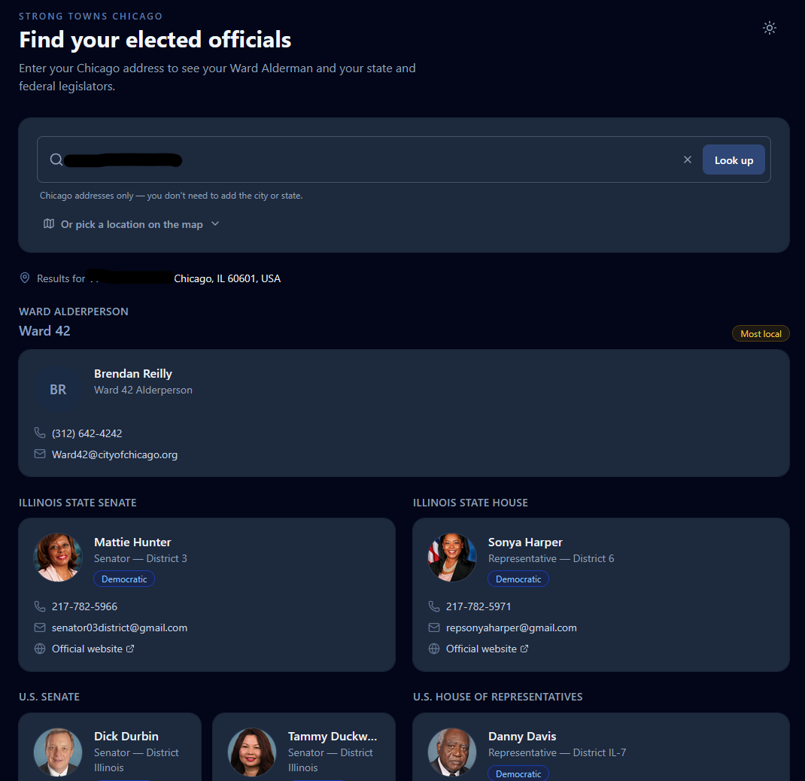

# Strong Towns Chicago — Elected Official Lookup

A lightweight Vue 3 + TypeScript + Tailwind CSS component that lets a Chicago
resident type a street address and see their Ward Alderperson, Illinois state
legislators, and federal legislators. Built to be dropped onto
[strongtownschicago.org](https://www.strongtownschicago.org/) or embedded via
`<iframe>` on any site.



## Features

- **Hierarchy-first layout**: Ward Alderperson is shown first and highlighted
  as "Most local", then State Senate / House, then U.S. Senate / House.
- **Two-column results** on wider screens; single-column on mobile.
- **Dark / light mode toggle** with preference saved across sessions.
- **Map picker**: optional Leaflet + OpenStreetMap pin that reverse-geocodes
  to a street address (requires the Google Maps API key).
- **No tracking. No cookies.** The only data stored locally is your dark/light
  mode preference.

## Requirements

- Node 20.19+ or 22.12+ (Vite requirement)
- An **OpenStates API key** — [register at open.pluralpolicy.com](https://open.pluralpolicy.com) (free tier available)
- A **Google Maps API key** with the **Geocoding API** enabled — required for
  address resolution and the optional map picker

## Setup

```bash
# 1. Install dependencies
npm install

# 2. Provide your API keys
cp .env.example .env.local
# then edit .env.local and fill in:
#   VITE_OPENSTATES_API_KEY=...
#   VITE_GOOGLE_MAPS_API_KEY=...

# 3. Run the dev server
npm run dev
```

Open `http://localhost:5173`.

### Production build

```bash
npm run build
npm run preview   # smoke-test the built bundle locally
```

The built app lands in `dist/` as fully static HTML/CSS/JS — host it anywhere
(Netlify, Cloudflare Pages, S3/CloudFront, the existing site's `/public`
directory, etc).

## Getting API keys

### OpenStates (Plural Policy)

1. Register at <https://open.pluralpolicy.com>.
2. Generate an API key from your account dashboard.
3. Paste it into `VITE_OPENSTATES_API_KEY` in `.env.local`.

### Google Maps (Geocoding API)

1. Create a project at <https://console.cloud.google.com/>.
2. Under **APIs & Services → Library**, enable **Geocoding API**.
3. Under **Credentials**, create an **API key**.
4. **Restrict the key** before shipping:
   - The Geocoding REST API is called directly from the browser, so it must
     use **IP restrictions** (not HTTP referrer restrictions — those block
     server-side Geocoding calls).
   - Under **API restrictions**, limit the key to *Geocoding API* only.
   - If you also use this key for the Maps JavaScript API (map picker),
     consider splitting into two keys — one with IP restrictions for geocoding,
     one with referrer restrictions for Maps JS.

> The key is visible in the browser bundle. IP or referrer restrictions are
> what actually protect it. Don't skip step 4.

## Embedding as an iframe

```html
<iframe
  src="https://find-reps.strongtownschicago.org/"
  title="Find your elected officials"
  style="width: 100%; min-height: 720px; border: 0;"
  loading="lazy"
  referrerpolicy="no-referrer-when-downgrade"
></iframe>
```

For a tighter fit, use
[iframe-resizer](https://github.com/davidjbradshaw/iframe-resizer) on the
parent page.

## Architecture

```
src/
  App.vue                      # shell: search, map toggle, dark mode
  main.ts                      # app bootstrap
  style.css                    # Tailwind v4 theme + component utility layer
  types.ts                     # domain types + CivicApiError
  services/
    civicApi.ts                # orchestrates all three data sources
    geocoding.ts               # forward geocoding (address→lat/lng) +
                               # reverse geocoding (lat/lng→address, map picker)
  components/
    AddressSearch.vue          # input + submit/reset
    ResultsDisplay.vue         # two-column group grid
    RepresentativeGroup.vue    # section per category (title, subtitle, cards)
    RepresentativeCard.vue     # single rep: photo/avatar, name, party, contacts
    PlaceholderAvatar.vue      # initials fallback when no photoUrl
    MapPicker.vue              # Leaflet pin picker (requires Maps API key)
    LoadingSpinner.vue
    ErrorMessage.vue
```

### Data sources

Representative data is assembled from three APIs on every lookup:

| Source | Provides | Auth |
| --- | --- | --- |
| **Google Geocoding API** | Address → lat/lng | `VITE_GOOGLE_MAPS_API_KEY` |
| **OpenStates `/people.geo`** | IL state legislators + U.S. Congress | `VITE_OPENSTATES_API_KEY` |
| **Chicago Data Portal** | Ward boundary → ward number → alderperson | None (public) |

The geocoding and OpenStates/ward calls run in parallel; the alderperson lookup
is sequential (needs the ward number first).

### How categorization works

`civicApi.ts` bins each OpenStates result by its OCD jurisdiction ID and
`org_classification`:

| Category | Jurisdiction ID contains | `org_classification` |
| --- | --- | --- |
| **Illinois State Senate** | `/state:il/` | `upper` |
| **Illinois State House** | `/state:il/` | `lower` |
| **U.S. Senate** | no `/state:` segment | `upper` |
| **U.S. House** | no `/state:` segment | `lower` |

The Ward Alderperson is sourced separately from the Chicago Data Portal using a
Socrata geospatial intersection query against the 2023 ward boundaries dataset.

## Known limitations

- Chicago addresses only. Entering a non-Chicago address will geocode
  successfully but return no alderperson and may return incorrect state
  legislators.
- Chicago's 2023 ward remap is reflected in the ward boundaries dataset
  (`p293-wvbd`). Verify the alderperson name against the city's own
  [Find My Alderman](https://www.chicago.gov/city/en/depts/mayor/provdrs/your_ward_and_alderman/svcs/find_my_alderman.html)
  tool when testing border addresses.
- OpenStates does not include city-level officials (mayors, aldermen) — that
  data comes exclusively from the Chicago Data Portal. If the Data Portal is
  unavailable, alderperson results will silently be omitted while state and
  federal results still show.

## Privacy

- No analytics or tracking cookies.
- `localStorage` stores one key: the user's dark/light mode preference.
- `referrerpolicy="no-referrer"` is set on external links and images.
- Outbound network calls on each address lookup:
  - `maps.googleapis.com` — address geocoding
  - `v3.openstates.org` — state and federal legislators
  - `data.cityofchicago.org` — ward boundary + alderperson data

## License

TBD by Strong Towns Chicago.
